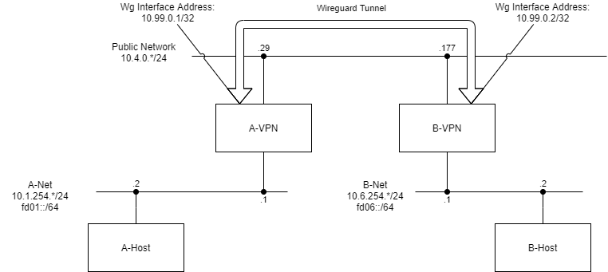

# Network For Developers
This is an example network deployment that can be used to mesh together different sites using a WireGuard tunnel.

Here is the network topology that will result:

Hosts in the A-Net are able to reach hosts in the B-Net and vice-versa. This network provides v6-in-v4 over an ipv4 wireguard connection. 

Please see [INSTRUCTIONS.md](doc/INSTRUCTIONS.md) for the guide for setting this type of network up.
